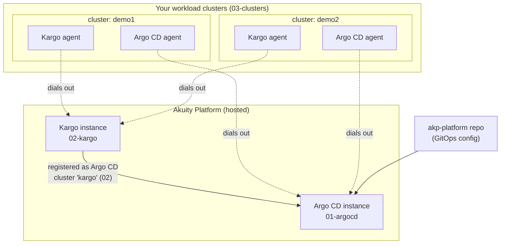

# akp-infra

**A self-guided Terraform journey for declaratively managing the Akuity Platform.**

In three small, ordered Terraform stacks you will:

1. Spin up a hosted **Argo CD** instance (`01-argocd`)
2. Spin up a hosted **Kargo** instance and wire it into Argo CD (`02-kargo`)
3. Register **workload clusters**, installing the Argo CD and Kargo agents into each (`03-clusters`)

This repo stands on its own — you end with a fully wired GitOps + promotion control plane and connected clusters, all captured in code. It also pairs with two sibling repos if you want to continue the story:

| Repo | Role |
|---|---|
| **akp-infra** (this repo) | The *platform layer*: instances, wiring, cluster/agent registration — Terraform |
| [akp-platform](https://github.com/akuity/akp-platform) | The *GitOps config layer*: Applications, ApplicationSets, Kargo pipelines — synced by the Argo CD instance you create here |
| [akp-monorepo](https://github.com/akuity/akp-monorepo) | The *application layer*: app source code and images that flow through the pipelines |

## Why declarative Akuity management?

You can click an Argo CD instance together in the Akuity UI in two minutes. So why Terraform?

- **Reproducibility** — rebuild your entire control plane (instances, settings, cluster registrations) from scratch with three `terraform apply`s. Useful for disaster recovery, new environments, and demos.
- **Review and audit** — changes to your GitOps engine itself go through pull requests, not console clicks.
- **Drift detection** — `terraform plan` tells you when someone changed an instance setting out-of-band.
- **Fleet scale** — registering the 20th cluster is a five-line map entry, not a UI wizard.

The tool doing the work is the official [`akuity/akp` Terraform provider](https://registry.terraform.io/providers/akuity/akp/latest/docs).

## Architecture



Key ideas:

- **Agents dial out.** Your clusters never expose their API servers to the platform. Terraform uses your kubeconfig once, to install the agents; after that all traffic is outbound from the cluster.
- **Kargo is itself an Argo CD cluster.** Stack 02 registers the Kargo control plane into Argo CD as a cluster destination named `kargo`. That's what lets Argo CD manage Kargo Projects, Warehouses, and Stages declaratively from Git.
- **Each stack has its own state** and stacks find each other by *instance name* via provider data sources — no `terraform_remote_state` coupling.

## Prerequisites

- An **Akuity Platform organization** ([sign up](https://akuity.io))
- An **API key with org-admin permissions** — [create one](https://docs.akuity.io/akuity-portal/organizations/api-keys/) in the portal
- **Terraform >= 1.5** — `brew install terraform`
- For step 3: one or more Kubernetes clusters and **kubeconfigs with embedded client certificates** (k3d/kind/minikube kubeconfigs work as-is; see the note on EKS/GKE/AKS in `03-clusters/modules/cluster/main.tf`)
- Optional, for verification: the [`argocd` CLI](https://argo-cd.readthedocs.io/en/stable/cli_installation/)

> **State note:** each stack keeps local state by default (`terraform.tfstate`, gitignored — state contains secrets). Fine for a personal journey; for anything shared, configure a [remote backend](https://developer.hashicorp.com/terraform/language/backend) (S3, GCS, Terraform Cloud) per stack. `docs/day-2.md` covers migrating existing local state.

## Step 0 — Credentials

Auth is environment-only. Nothing secret ever lands in a file in this repo.

```bash
export AKUITY_API_KEY_ID=...
export AKUITY_API_KEY_SECRET=...

# Admin password for the Argo CD and Kargo UIs (TF_VAR_ prefix feeds the
# admin_password variable without putting it in tfvars):
export TF_VAR_admin_password=...
```

## Step 1 — The Argo CD instance (`01-argocd`)

```bash
cd 01-argocd
cp terraform.tfvars.example terraform.tfvars   # set org_name
terraform init
terraform apply
```

**What you get:** a hosted Argo CD control plane with:

- `declarative_management_enabled` — so Argo CD's own config (AppProjects, Applications) can be driven from Git
- admin account with UI login **and** API-key capability (`accounts.admin = "apiKey,login"`)
- admin password set from your env var (bcrypt-hashed; see the `ignore_changes` comment in `main.tf` for why Terraform must ignore it afterward)

**Verify:** `terraform output argocd_url`, open it, log in as `admin` with your password. You should see an empty Argo CD — no clusters, no apps. That's correct.

```
After step 1:

  Akuity Platform
  └── Argo CD instance "quickstart-argocd"   (empty — no clusters yet)
```

## Step 2 — The Kargo instance, wired to Argo CD (`02-kargo`)

```bash
cd ../02-kargo
cp terraform.tfvars.example terraform.tfvars   # set org_name
terraform init
terraform apply
```

**What you get:**

- a hosted Kargo control plane (promotion controller enabled, admin account enabled)
- **the wiring**: an `akp_cluster` named `kargo` inside your Argo CD instance, backed by the Kargo control plane (`cluster_type = "kargo"`, no kubeconfig involved)

That second resource is the important one to understand. Registering Kargo *as an Argo CD cluster* means Argo CD Applications can target the Kargo control plane as a destination — so Kargo Projects, Warehouses, and Stages become just more GitOps-managed resources. The akp-platform repo's `kargo-apps` ApplicationSet targets exactly this `kargo` destination.

**Verify:** in the Argo CD UI under *Settings → Clusters*, a cluster named `kargo` now exists. `terraform output kargo_url` opens the Kargo UI (log in as `admin`).

```
After step 2:

  Akuity Platform
  ├── Argo CD instance "quickstart-argocd"
  │   └── cluster "kargo"  ──────────────┐   (destination for Kargo config)
  └── Kargo instance "quickstart-kargo" ◄┘   (empty — no agents yet)
```

## Step 3 — Workload clusters and agents (`03-clusters`)

Put a kubeconfig for each cluster somewhere Terraform can read it (`.kubeconfigs/` in this repo is gitignored for exactly this).

Don't have a cluster handy? `scripts/bootstrap-clusters.sh` creates one with k3d, kind, or minikube (auto-detected, in that order) and writes a standalone kubeconfig straight to `.kubeconfigs/`, without touching your real default kubeconfig or current-context:

```bash
cd ../03-clusters
./scripts/bootstrap-clusters.sh          # demo1 only, auto-detected provider
./scripts/bootstrap-clusters.sh demo1 demo2   # both, opt-in
./scripts/bootstrap-clusters.sh --help
```

Already have Kubernetes enabled in OrbStack? Skip the script — OrbStack is a single shared cluster, not something creatable per-name, so it can only stand in for one of demo1/demo2, not both. Extract it directly:

```bash
kubectl config view --raw --minify --context=orbstack > .kubeconfigs/demo1.yaml
```

Then:

```bash
cp terraform.tfvars.example terraform.tfvars   # set org_name + clusters map
terraform init
terraform apply
```

**What you get, per cluster** — two agents installed into the `akuity` namespace, with distinct roles:

- **Argo CD agent** — the deploy arm. Pulls desired state from the hosted Argo CD instance and applies it in-cluster. This is what makes the cluster an Argo CD destination.
- **Kargo agent** — the promotion arm. Self-hosted (`akuity_managed = false`), watches Warehouses for new artifacts and executes promotion steps. Its `remote_argocd` link connects Kargo promotions to Argo CD syncs on your instance.

The apply **blocks until each agent reports healthy** (`ensure_healthy = true`) — a successful apply means live agents, not just submitted manifests.

Things to know (all commented in the code):

- `tune_agent_resources = true` applies `templates/kustomization.yaml` to shrink agent CPU requests — use it for k3d/kind/minikube, where default requests can leave pods Pending.
- **Two-phase fleet registration:** register clusters with *no* labels first; add ApplicationSet-triggering labels (like `fleet = "true"`) in a second apply after agents are healthy.
- `kargo_default_shard` picks which cluster's Kargo agent runs promotions by default. It lives here (not in 02) because it must reference an agent that exists.

```
After step 3:

  Akuity Platform                              Your infrastructure
  ├── Argo CD instance "quickstart-argocd"
  │   ├── cluster "kargo"                      ┌─ cluster demo1 ──────────┐
  │   └── cluster "demo1"  ◄─────(agent)────── │  akuity/argocd agent     │
  └── Kargo instance "quickstart-kargo"        │  akuity/kargo agent      │
      └── agent "demo1"    ◄─────(agent)────── │   (default shard)        │
                                               └──────────────────────────┘
```

## End-to-end verification

```bash
# Argo CD sees the Kargo control plane AND your workload clusters:
argocd login <argocd_url host> --username admin --password $TF_VAR_admin_password --grpc-web
argocd cluster list
# NAME    ...  STATUS
# kargo        Successful/Unknown (no apps yet)
# demo1        Successful/Unknown (no apps yet)
```

In the **Kargo UI** (`terraform output -state=../02-kargo/terraform.tfstate kargo_url`, or just the URL from step 2), the *Agents* view shows each workload cluster's agent as healthy, with the default shard marked.

If both are true, the platform layer is done: Argo CD can deploy to every cluster, and Kargo can promote across them and trigger Argo CD to sync.

## Where to next

- **Bootstrap GitOps** — point the Argo CD instance at [akp-platform](https://github.com/akuity/akp-platform) and let its app-of-apps take over: apps, addons, and Kargo pipelines all from Git. (The `kargo` cluster destination and any `fleet` labels you added here are what its ApplicationSets key on.)
- **Adopt existing resources** — already have UI-created instances or clusters? [docs/importing-existing.md](docs/importing-existing.md) walks through `terraform import`.
- **Run it like production** — drift detection, version upgrades, password rotation, cluster add/remove, remote state: [docs/day-2.md](docs/day-2.md).

## Repository layout

```
akp-infra/
├── 01-argocd/                  # Stack 1: Argo CD instance
├── 02-kargo/                   # Stack 2: Kargo instance + "kargo" cluster wiring
├── 03-clusters/                # Stack 3: workload clusters + agents
│   ├── modules/cluster/        #   per-cluster module (Argo CD + Kargo agent)
│   ├── scripts/
│   │   └── bootstrap-clusters.sh  # create k3d/kind/minikube demo clusters + kubeconfigs
│   └── templates/
│       └── kustomization.yaml  #   agent CPU tuning for small clusters
└── docs/
    ├── importing-existing.md
    └── day-2.md
```

Each stack directory is a complete Terraform root module: `providers.tf`, `variables.tf`, `main.tf`, `outputs.tf`, `terraform.tfvars.example`, and a committed `.terraform.lock.hcl`.
